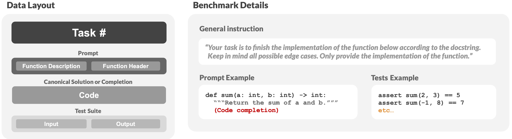
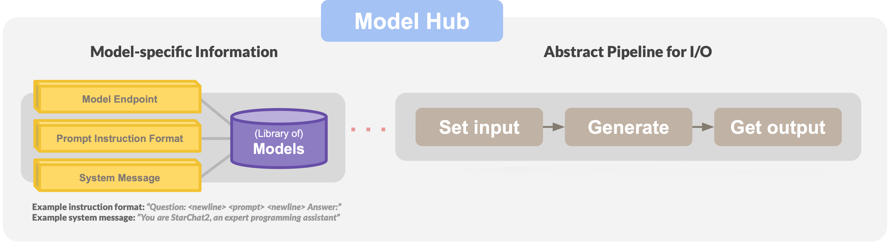

<h1 align="left">HumanEvalPro: An Enhanced Foundation for the Family of Benchmarks around HumanEval</h2>
<p align="center">
    
    
    
</p>

---
<h2>🚨 Data Availability Statement 🚨</h2>
<h3>As of now, the full improved dataset is not available for download. A subset of 50% of the dataset is available for download and can be found [here](./HumanEvalPro.json). The full dataset will be available for download upon acceptance of the paper.</h3>
<h3>The information provided below refers to the full dataset. This includes the full dataset, the helper scripts, and the translated languages.</h3>
---

Introducing "*HumanEvalPro*", an enhanced foundation for the family of benchmarks around [HumanEval](https://github.com/openai/human-eval). This dataset aims to resolve the issues of the original dataset. Subsequently, enhanced variants of the original dataset can be generated from this repository. This is crucial, as variants based off the original HumanEval version generally contain these issues:
* Variants that cover multiple languages have duplicated the original issues.
* Variants that added tests used the original incorrect solutions to generate the output.
* Variants based on human corrections or translations are inconsistent.

This new version, HumanEvalPro, contains improved documentation, proper canonical solutions and substantially improved test coverage. The complexity of (some/most) problems has been increased with changes in the problem descriptions and tests now requiring models to be thoughtful about edge cases similar to the intuition of adequate software engineers.


## How to contribute
* 🐛 Report bugs
* ⭐ Star the project
* ✉️ Post about it (e.g. Twitter, LinkedIn, Reddit, etc.)
* 🔗 Refer this project in your project’s readme
* 💬 Mention the project at local meetups and tell your friends/colleagues

## Details 


### 📚 - Dataset
The HumanEvalPro dataset has the following characteristics compared to the original:

| Statistic                                   | HumanEvalOriginal.json | HumanEvalPro.json  |
| ------------------------------------------- | ---------------------- | ------------------ |
| Total number of asserts                     | 1325                   | 2551               |
| Average number of asserts                   | 8      | 16 |
| Median number of asserts                    | 7                    | 11               |
| Min number of asserts                       | 1                      | 4                  |
| Number of problems with less than 5 asserts | 34                     | 2                  |


The dataset is also available in separate files as well, please refer to the `folderized/py` folder.

### 📝 - Making changes
When making changes to the dataset (`/py` folder), please run the following pipeline to update all the files accordingly:
1) Ensure the changes in the dataset still pass all the tests by running `verify_tests.py` in the root directory.
2) Create (or overwrite) a .json file accumulating the new data in the `folderized/py` folder by running `jsonify.py` in the `/helpers` directory.
3) To analyze the dataset, run `analytics.py` in the `/helpers` directory. Note, the generate file(name) in step 2 is required to be present in the list `jsons` in the script in order to output the results. For quick inspection of the function signatures, you may also use `type_inspector.py` in the `/helpers` directory.
4) To translate the dataset to other languages using the MultiPL-E framework, the data needs to be converted to a format that can be used by the framework. A great start is using `multipl.py` in the `/helpers` directory -- in particular the `convert_problems_to_commented_version` function. However, some problems might require manual adjustments, inspect the generated data carefully. E.g., problems with `def`s inside the canonical solution with a docstring can cause the script to insert the comment in the wrong place. Then, within the MultiPL-E repository, generate the other languages by running the `hep.py` script (see `/helpers`) within the `/dataset_builder` directory. Note, the MultiPL-E repository is not included in this repository and needs to be cloned separately and placed within the root of this repository. The generated files will be available in the `/translated_languages` folder. Since the MultiPL-E framework only supports assert statements containing deep equality, problems that require float comparisons are not feasible to translate, in addition to problems that contain multiple methods (helper methods). This results in problems [2, 4, 32, 38] in range(164) not being translated, as of now. This is a substantial improvement to the original HumanEval, where many more problems are not being translated due to problems, but most of these problems have been changed to be supported by MultiPL-E in HumanEvalPro.

### 📦 - Structure

The dataset and models used for experimenting have the following structure:




For more details, please refer to the paper.

### 🗑️ - Issues
There are many issues with the original dataset. The following illustrates some of these issues. Note, this is not an exhaustive list by any means. Please check the difference between `HumanEvalOriginal.json` and `HumanEvalPro.json` for a detailed overview.

#### Problem #47
```python
def median(l: list):
    """
    Return median of elements in the list l.
    >>> median([3, 1, 2, 4, 5])
    3
    >>> median([-10, 4, 6, 1000, 10, 20])
    15.0
    """
```
The docstring contains an incorrect example. The median
of [-10, 4, 6, 1000, 10, 20] should be 8 instead of 15, as 6 and 10 are the two middle
values in this list of even length – not 10 and 20.

#### Problem #95
```python
def check_dict_case(dict):
    """
    Given a dictionary, return True if all keys are strings in lower 
    case or all keys are strings in upper case, else return False.
    The function should return False is the given dictionary is empty.
    Examples:
    check_dict_case({"a":"apple", "b":"banana"}) should return True.
    check_dict_case({"a":"apple", "A":"banana", "B":"banana"}) should return False.
    check_dict_case({"a":"apple", 8:"banana", "a":"apple"}) should return False.
    check_dict_case({"Name":"John", "Age":"36", "City":"Houston"}) should return False.
    check_dict_case({"STATE":"NC", "ZIP":"12345" }) should return True.
    """
    if len(dict.keys()) == 0:
        return False
    else:
        state = "start"
        for key in dict.keys():

            if isinstance(key, str) == False:
                state = "mixed"
                break
            if state == "start":
                if key.isupper():
                    state = "upper"
                elif key.islower():
                    state = "lower"
                else:
                    break
            elif (state == "upper" and not key.isupper()) or (state == "lower" and not key.islower()):
                    state = "mixed"
                    break
            else:
                break
        return state == "upper" or state == "lower"
```
The function needs to check if all keys are upper or lower case in a dictionary (data structure with keys mapped to values), yet it `break`s in line 31 (instead of `continue`) when the state variable is "upper" or "lower" and the current key matches this capitalization. Instead of `continue`ing to check the rest of the keys, the function breaks and returns true, which could be wrong, as later keys might have incorrect capitalization (meaning the state would have been "mixed"). 

For example, the following input yields `True`: `check_dict_case(“abcd”:“d”,“abce”:“e”,“abcF”:“f’,9:“g”,“ABCH”:False)`, as the first two keys, i.e. abcd and abce, result in a “lower” state and then break out of the program in the incorrect else-statement. Meanwhile, the dictionary contained inconsistent capitalization and wrong types.

This issue also indicates a lack of test coverage or problematic test generation for enhanced variations of the benchmark using the canonical solution as a way to generate the “correct” output.


#### Problem #163
```python
def generate_integers(a, b):
    """
    Given two positive integers a and b, return the even digits between a
    and b, in ascending order.

    For example:
    generate_integers(2, 8) => [2, 4, 6, 8]
    generate_integers(8, 2) => [2, 4, 6, 8]
    generate_integers(10, 14) => []
    """
    lower = max(2, min(a, b))
    upper = min(8, max(a, b))

    return [i for i in range(lower, upper+1) if i % 2 == 0]
```
The description within the docstring does not match the implementation or example tests. In addition, the problem lacks proper test coverage.

Firstly, the description mentions "*between*" `a` and `b`, yet the implementation and example tests include `a` and `b` in the output. Instead of range `(lower, upper+1)`, the implementation should use `(lower+1, upper)`.

Furthermore, `0` is considered to be a digit `(0--9)`, yet the implementation does not account for this. Given two positive integers `a` and `b` where the numbers in between cross `0`, e.g. range `(8, 12)` crosses `10`, the implementation should include `0` in the output based on the description.

Lastly, as the implementation mentions the digits between `a` and `b`, it should consider all the digits of the numbers in between. Digits are not only the last digit of a number. For example, number `2024` contains digits `0`, `2`, and `4`. Hence, the example test `generate_integers(10, 14) => []` is incorrect, as the numbers in between, i.e. `11`, `12`, and `13`, contain the even digit `2`, meaning the output should be `[2]`.

The implementation is altered to account for the above issues. In addition, the example tests are updated to reflect the changes. Lastly, some additional manual tests are added to cover the untested cases, e.g. `assert generate_integers(146801, 146803) == [0, 2, 4, 6, 8]`.

### Credits
* OpenAI: The original dataset, "HumanEval".
* Anonymized: The authors of the paper.